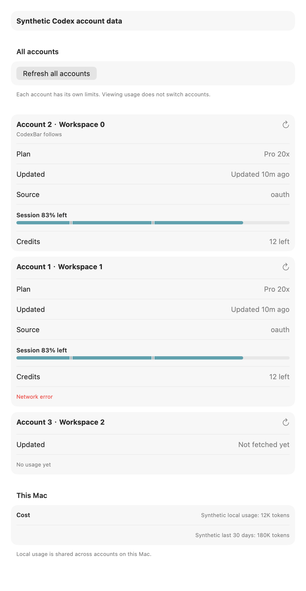

# Codex account overview proof

All identities, credentials, quota values, credits and local token counts in this proof are synthetic. The fixtures do not copy any real account or usage history.

The opt-in test renders the production `ProviderAccountUsageOverviewView` and local cost rows through `NSHostingView`, without launching the app or displaying a window. It covers a cached followed account, a failed sibling retaining its original usage age, an account without usage, shared local usage shown once, and private labels at a narrower width. Rendering proves the native layout, not mouse interaction or a live account refresh.

```sh
source Scripts/test_environment.sh
CODEXBAR_ACCOUNT_OVERVIEW_PROOF_DIR=/tmp/codex-account-overview-proof \
  swift test --build-system native --jobs 4 -Xswiftc -gnone \
  --filter 'render synthetic.*settings'
```

The companion refresh tests use synthetic managed OAuth homes, stubbed provider/reset-credit transports, in-memory settings and a temporary file-backed snapshot store. They verify cache-only reads; zero/one-account fallback; single-account refresh without changing the followed usage, selection or credential files; all-account refresh in bounded batches beyond the six-account menu limit; failure retention; privacy; stale-result rejection after selection changes; PAT exclusion; and verified error ownership. The header regression counts requests so a second usage fetch cannot hide behind a set comparison, while checking that dashboard enrichment still runs.

The before render reconstructs the prior single-account usage section with the unchanged production info and metrics components and the same synthetic account fixture. It is a layout comparison, not a capture of an installed older app. The overview renders cover English and Simplified Chinese at 860 and 560 points, with privacy enabled at the narrower width.

The header fixture isolates the credits transport from usage request counting and verifies dashboard publication. Distinct-email accounts retain the followed owner's Code review metric; same-email workspaces retain the existing display-only policy, and neither siblings nor mismatched publication owners inherit the metric.



