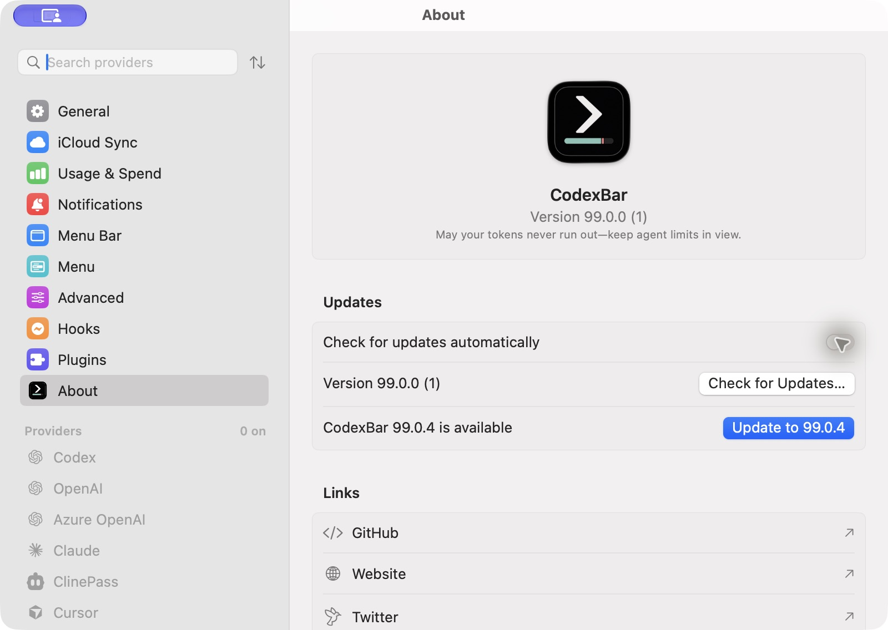
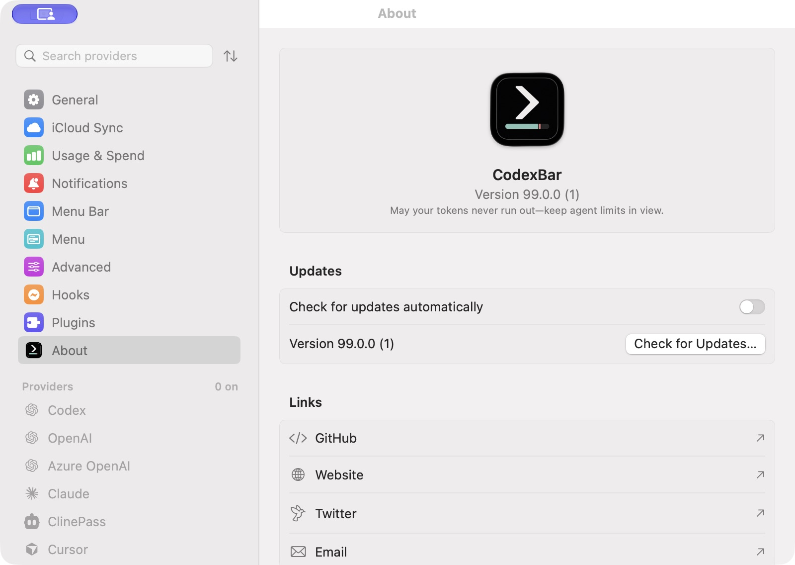

# Homebrew update notification: native application proof

This folder uses synthetic versions (`99.0.x`) and an isolated documentation-only bundle. No account, credential, usage history, private endpoint, or personal home path is included in the published receipts.

## Production route

The freshly built full CodexBar executable sends through the unchanged production `HomebrewUpdaterController` → `HomebrewUpdateNotifier.Dependencies.live` → `AppNotifications.shared` → `UNUserNotificationCenter`. The real notification center delegate is `AppNotifications.shared`; the fixture does not call or replace its notification response callbacks.

The production `AppDelegate.applicationWillFinishLaunching` registers the click handler. The production `configure`, pending settings-open state, `openSettings`, `SettingsWindowController`, `PreferencesView`, and `AboutPane` handle the resulting settings route. A fixture wrapper delays settings configuration by three seconds to exercise a notification response arriving before settings are ready. Ordinary provider and status-item startup is excluded from this fixture.

The build script temporarily adds a DEBUG entry guard and an updater-factory branch, and copies the documentation-only Swift launcher into the app target. It restores the original app source and removes the temporary helper in `finally`; normal builds contain neither the launcher nor the factory branch. The [build receipt](build-receipt.json) records the original and instrumented entry hashes, production source hashes, fixture hash, source commit, and executable hash.

The bundle is ad-hoc signed and passes `codesign --verify --deep --strict`. This validates native notification integration in a locally signed fixture app; it does not claim Developer ID notarization or delivery from the official distributed bundle.

## Evidence

The [native event receipt](native-events.jsonl) is an allowlisted diagnostic stream produced by the running application. Notification authorization and delivered/pending requests come from the real system notification center. Saved submitted versions and automatic-check preferences come from the isolated app's real persistent standard defaults. Settings visibility and selected pane come from the actual production window and preferences selection.

The [verification report](verification.json) checks compiled-source identity and observed lifecycle transitions. The [native UI transcript](ui-interactions.json) records manually opening About separately from clicking a system notification. The verifier explicitly excludes those manual opens from notification-click proof.

The [validation receipt](validation-receipt.json) records passing code checks, 54 focused tests in six suites, and the complete inventory-verified regression run on production commit `c16e1a6f7`: 14,081 methods, all 1,593 selections, and 144/144 groups passed on their first attempt, with no retries or timeouts. An earlier serial `make test` invocation was deliberately interrupted after eight successful groups to use the documented parallel runner; that interrupted run is not counted as a pass. The current fixture was rebuilt from `54ada0fe3`; all six production notification and settings-route source hashes remain identical.

On `54ada0fe3`, the follow-up `make check` passed with zero violations in 2,848 files, and the focused notification plus synchronized cost-row regression selection passed 61 tests in nine suites. The existing maintainer continuation in the PR body also records a complete 144/144-group regression on that revision; that reported run is kept separate from the directly observed local results.

After synchronizing with main at `08eb56931`, the archived native captures and their source-identity report still attest `54ada0fe3`. The notification sender, delegate, updater, app entry, and settings controller are unchanged; main changes only the About pane's Website destination among the six receipt-listed files. Verify these archived receipts against their recorded source revision. Fresh captures should use a newly built bundle and a receipt from that same revision.

The integrated production revision `1607c1a18` passed `make check` with zero violations in 2,871 Swift files. Its complete inventory-verified regression covered 14,174 methods and all 1,607 selections: 145/145 groups passed on their first attempt, with zero failed groups, retries, or timeouts. The [main synchronization validation receipt](main-sync-validation.json) records these results separately from the archived native captures.

### Captured results

These receipts are partial native evidence from October 8, 2026. Delivery, deduplication, and saved disabled-check behavior are observed; native notification-click proof remains outstanding.

| Behavior | Observed result |
| --- | --- |
| Native delivery | The system center returned the silent `99.0.1` through `99.0.5` requests as delivered. The production notification delegate remained installed. |
| Permission state | Launch 1 observed denied authorization, no delivered request, and no saved submitted version in that snapshot. |
| Restart deduplication | Launch 2 loaded the saved `99.0.1` submission, performed one startup fetch, and did not submit that version again. |
| Visible banner | Pending; delivered-request diagnostics do not establish that a banner appeared on screen. |
| Running-app notification click | Pending; observed About transitions came from the fixture's settings control and are explicitly excluded. |
| Cold-launch notification click | Pending. |
| Saved disabled checks after restart | Observed: the actual About toggle was turned off, delivered notices were removed, and launch 3 retained the saved false preference. Its startup and explicit automatic-check request performed zero fetches. |

The [interaction record](interaction-record.md) distinguishes system diagnostics from UI observations and documents the remaining steps. Launch 1 used an earlier fixture wrapper with the same production notifier sources. The [earlier build receipt](build-receipt-c16e1a6f7.json) identifies the executable used for launches 2–3; the [current receipt](build-receipt.json) identifies the executable used from launch 4. Neither receipt attests the earlier launch-1 wrapper's executable identity.

### Native disabled-check screenshots

These window captures contain only synthetic app data and disabled providers. They demonstrate the actual preference UI, not notification-click routing.






## Reproduce

```sh
python3 docs/proof/homebrew-update-notifications/build-app-proof.py .
open .build/homebrew-notification-proof/CodexBarUpdateProof.app
```

Allow notifications for **CodexBar Update Proof** if macOS has disabled them. The startup automatic check discovers the synthetic newer version. **Check next synthetic version** supplies a higher fixture cask version to the production automatic-check path. It never runs an actual Homebrew upgrade.

Use the real system notification to open About, quit the fixture with Command-Q while a new notification remains, then click that notification to cold-launch it. Restart without changing the fixture version to observe deduplication. Turn off automatic checks using the actual About toggle, quit, and relaunch; **Observe automatic check** then records whether the production controller fetched anything.

Copy the resulting `build-receipt.json` and `native-events.jsonl` from `.build/homebrew-notification-proof` into this directory, then run:

```sh
python3 docs/proof/homebrew-update-notifications/verify-native-proof.py .
```
